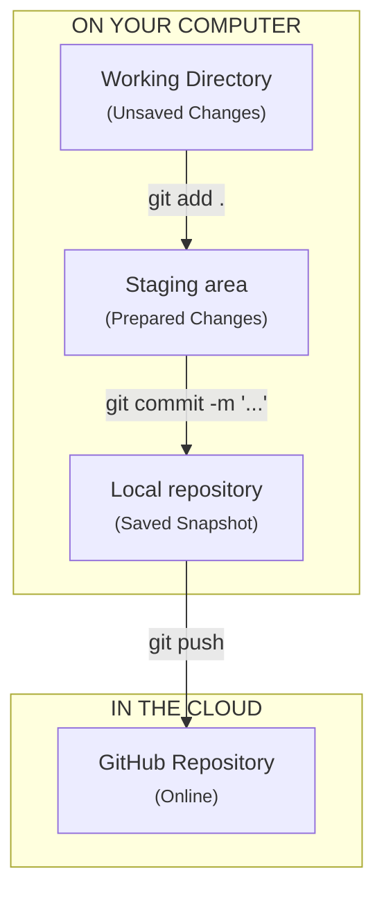

# Git for GitHub: How to use simple Git commands to manage a GitHub repository

Recently,
I was working on creating a website on a cloud-based IDE (CodeHS).
One night,
I was editing,
and then when I was done,
I simply turned off my monitor and disabled my mouse and keyboard.
Then,
the next day at school,
I continued to work on the website,
and made significant changes.
When I got home,
I made more significant changes,
but then realized something very important.
What I realized is
that when I continued to work on the project at home,
the cloud-based IDE hadn't refreshed to the new code,
and overwrote the work I did at school when I saved my new work.

So,
what is the purpose of me telling you this?
Is it to say that you should always close your code editor when you're done working,
or some other trick to prevent this from happening?
No,
it definitely is not.

After the initial panic,
I realized that the cloud-based IDE had a history section,
which has a detailed log of every change that happened to every file.
I then looked back at my old copy,
copied the changes,
and put them back into my new code.

Now,
imagine you aren't using a cloud-based IDE,
and your just editing a file on your computer,
in an IDE,
or simply your terminal.
To clarify,
Git is not cloud-based,
it is local,
(sitting on your computer),
that connects to the cloud
(GitHub).
What happens when something breaks?
For some environments,
this could be catastrophic,
and make you loose a lot of work.
When you make an update to a file,
the last state and all the states before it
are gone.

But,
this isn't the only thing that can happen.
When you use a version control system (VCS),
like Git,
you can always go back to your previous commits,
(snapshots of your code).

The work I almost lost wasn't very important;
that work didn't effect anyone,
except myself.
Imagine what would happen if I was working on something more important,
or even just working on something for a job.

Before learning how to manage your project, it helps to understand what Git actually is. Git is overwhelmingly the most popular version control system (VCS), and is completely free to use.

> "By far,
> the most widely used modern version control system in the world today is Git.
> Git is a mature,
> actively maintained open source project originally developed in 2005 by Linus Torvalds,
> the famous creator of the Linux operating system kernel."
> - Source: [Atlassian](https://www.atlassian.com/git/tutorials/what-is-git)

In this guide, you will learn how to use the Git version control system (VCS) to manage a GitHub repository by initializing a project, linking it your GitHub repository, and using it to manage your GitHub repository.

## Section 1: Installing and Setting Up Git
In this section, we will navigate to our terminal and install Git.

### Step 1: Opening your terminal
- Windows: Press the `Windows Key`, type Powershell, and hit enter.
- macOS: Press `Cmd + Space`, type Terminal, and hit enter.
- Linux: Press `Ctrl + Alt + T` to open your default shell.

### Step 2: Installing Git
In your terminal, run the following command to determine if you have Git installed

```shell
git --version
```

- If a version number appears, you are ready to go to step 3.
- If the command is not recognized, follow the steps below to install Git.

Windows Installation:

To install Git on Windows, you can do so in one of the following ways.

1. Run the following command to install Git with Winget: `winget install --id Git.Git -e --source winget`
2. Run one of the standalone installers found at [Git-scm](https://git-scm.com/install/windows)


macOS Installation:

To install Git on macOS, you can do so by installing Git with homebrew.

If you do not have homebrew, install homebrew with the following command: `/bin/bash -c "$(curl -fsSL https://raw.githubusercontent.com/Homebrew/install/HEAD/install.sh)"`

Once you have homebrew, run `brew install git` to install Git.

Linux Installation:

To install Git on Linux, use your distributions package manager.

- Debian/Ubuntu: `sudo apt-get install git`
- Fedora: `sudo dnf install git`
- Arch: `sudo pacman -S git`


### Step 3: Setting up Git (Identity Configuration)

The next step to using git is to set variables that let Git know who you are. These are permanently attached to every commit you do, which allows platforms like GitHub to attach it to your profile card.

```shell
# Set your display name (can be your real name, your GitHub username, or many other things)
git config --global user.name "Your Name"

# Set your email (MUST match your GitHub email)
git config --global user.email "your-email@example.com"
```

## Section 2: Tracking Version History

In this section, we will initialize a local git project and learn how to use basic git commands to track the files.

### Step 1: Initializing local Git Project

In this step, we will initialize our local Git project. First, navigate to the directory you would like to store your project, and run the following command.

```bash
git init -b main
```

`-b main` ensures the default branch is named `main`, matching GitHub's default layout.

### Step 2: Stage and Commit files

In this step, we will stage our files, (which means to tell Git to start tracking the files), and to commit our files (making a snapshot of the file on our local machine.)

To stage the files, type the following command:

```bash
git add .
```

The `.` symbol is our current directory, which tells Git to stage all the files in your current location.

Next,
we will commit these files and add a commit message.
It is standard practice to use the imperative mood
(e.g. "Add css rule to fix whitespacing",
not "Added css rule to preserve whitespacing")
for commit messages,
as this follows the convention used by Git itself.

```bash
git commit -m "Initial commit"
```

The `-m` flag stands for `message`, which is why we put our commit message after it.

## Section 3: Making GitHub repository and linking with local project

In this section, we will make a GitHub repository and link our local project with it.

### Step 1: Initializing Repository

In this step, we will make a GitHub repository, which is where we publish our project. If you do not have a GitHub account, please make one.

1. Navigate to [the GitHub homepage](https://github.com/) and sign in if you are not already.
2. Click the green `New` button located at the top right of the `Top Repositories` menu that is on the left side of your screen. If you are unable to find this button, click on [this link](https://github.com/new) instead, which will take you to the same location.
3. Set a repository name, and make sure that all of the `Add ...` boxes are unchecked.
4. Click `Create Repository`
5. Remember the URL for your repository


### Step 2: Linking local project to repository

In this step, we will link our local project to the GitHub repository we just made.

Navigate to your local project, and run the following command, while ensuring to replace `<REPOSITORY LINK>` with the link you remembered in 3.1.5

```bash
git remote add origin <REPOSITORY LINK>
```

### Step 3: `Push`ing

In this step, we will push to our repository on GitHub. This means that your local project and all the changes you made, along with your commit messages, will be put on GitHub.

Navigate to your local project, and run the following command

```bash
git push -u origin main
```

The flag `-u` stands for `upstream`,
which links your local branch to the remote branch
so that in the future,
Git knows exactly where to send your code.


## Section 4: Wrapping up and Next Steps

You have successfully initialized a local project, tracked your changes, and pushed your code securely to the cloud on GitHub.

Now that your local project is linked to your remote GitHub repository, your workflow becomes way more simpler.


### What to do in the future



In the future,
your workflow isn't as complicated as it just may have been.
You just need to remember
4 simple commands
for the most part.

First,
you need to know the
`git status`
command.
This command shows you:
1. The branch you are on
2. How many commits above or behind you are
compared to the GitHub
3. Changes that have not been staged to commit
4. Untracked files
It is recommended to look at the output of this command
before you start working.

When you want to stage files (tell Git to track them),
you simply run the command
`git add <FILES, or . for every file in the directory>`

When you want to commit these files
(to save a snapshot of them to your local machine),
you simply run the command
`git commit -m "COMMIT MESSAGE"`
Keep in mind that at this point, the new changes have not left your computer.

Then, when you want to put them onto GitHub,
you just run the command
`git push`
If you want to be extra sure that the
`git push -u origin main` was remembered,
you can always just run
`git push origin main`
if you want to be sure.

And,
that's your workflow now.
See how simple it is?

### Important Note: .gitignore
It is standard practice to add a `.gitignore` file in your root directory.
The purpose of the `.gitignore` file is to tell Git what files to not track,
keeping it from the public (GitHub).
You simply type specific rules into the file
with one line for each.
Here is quick tutorial.

* You can use `#` signs to indicate that everything after it on the line is a comment
* If you type a literal name (i.e. `secret.txt`), that specific file will be ignored
* Patterns ending with a `/` (i.e. `private/`) match only directories and their entire contents
* `*` Matches any amount of characters. For example, `*.txt` matches all files ending in `.txt`,
and `log*` matches all files starting in `log`
* `**` matches directories recursively. For example, `**logs` matches any directory named `logs` in the project
* Lines starting with `!` re-include a file that was excluded by a previous rule
* Using a `/` anchors the pattern to where the `.gitignore` file resides,
NOT the root of the computer


## Section 5: Ending Notes

In this tutorial,
you learned how to
use Git to manage a local project
and to link that local project
with GitHub.

Now that you see how you do it,
I think it's important
that I explain a bit more about
why we do it.

Imagine you are working on
an Automated Market-Making (AMM) System,
which is a system that place buy and sell orders
for many stocks simultaneously,
that pocket small price differences
without human intervention,
and you accidentally make an error in the code,
which is costing the company money.

If there was no version control system (VCS),
the company could experience significant downtime and financial loss.
With the usage of a version control system (VCS) like Git,
the company can easily revert back to slightly older working code
and restart the program,
saving the company a lot of money.

Keep in mind that with Git and GitHub,
there are many features that allow code
to be collaborated on by many people
at the same time,
and also provides features to
make sure code can be checked by other collaborators before
it is approved.

This is why version control systems (VCS)
are so important in the development workforce.

Even if you do not have a coding job
and are just coding on your own,
you can still loose significant progress
when you do not use version control systems (VCS),
(like we just discussed).

Also,
I want to put out that
while I may not write the best commit statements,
I am working to make better ones.
A good standard for writing commits that I found is
the Conventional Commits standard.
I will not describe the standard here,
but I recommend to read
[this summary](https://www.conventionalcommits.org/en/v1.0.0/#summary)
to learn more about it.
